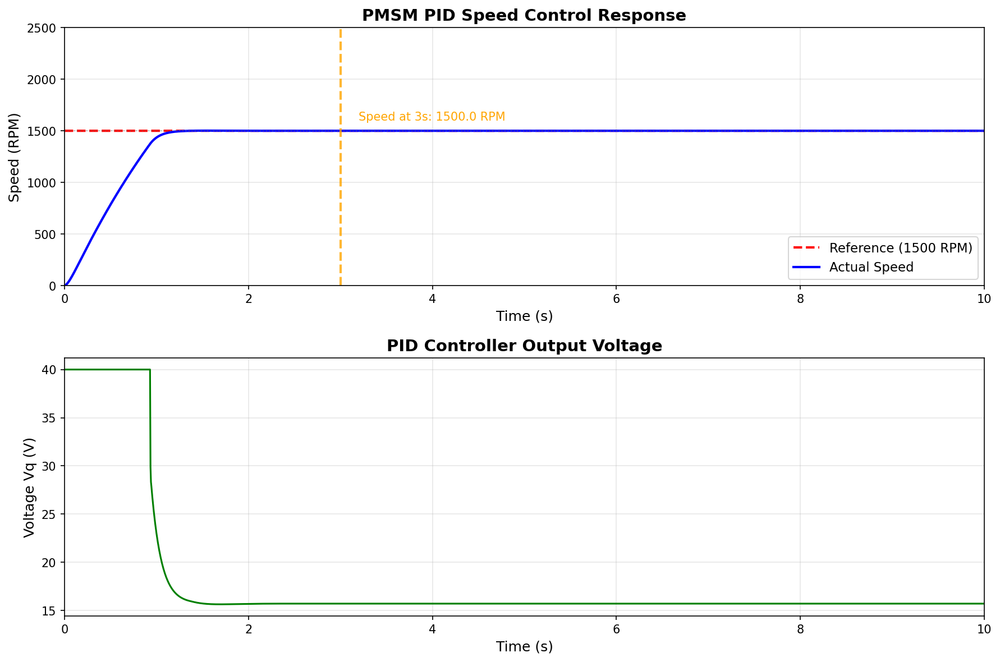

# PMSM PID Speed Control Simulation

> 永磁同步电机(PMSM) PID转速控制系统仿真
>
> English | [中文](#中文)

---

## English Version

### Overview

This project simulates a **Permanent Magnet Synchronous Motor (PMSM)** speed control system using a **PID controller** implemented in Python. The simulation demonstrates achieving 1500 RPM from 0 within 3 seconds.

### Key Results

| Metric | Target | Result |
|--------|--------|--------|
| Speed at 3s | 1500 RPM | ✅ 1500.00 RPM |
| Overshoot | < 2% | ✅ 0.24% |
| Stability (5-10s) | < 2 RPM variation | ✅ 0.00 RPM |

### Project Structure

```
pid-pmsm/
├── pmsm_pid_control.py          # Main simulation
├── pmsm_pid_speed_control.png    # Results plot
├── skill/                        # PID tuning skill
│   ├── skill.md                  # Skill configuration
│   ├── pid_tuning_core.py        # Core algorithm
│   └── README.md                # Skill documentation
└── README.md                     # This file
```

### Quick Start

```bash
# Run simulation
python pmsm_pid_control.py

# Output: pmsm_pid_speed_control.png
```

### PID Tuning Skill

A reusable PID tuning tool for motor control:

```python
from skill.pid_tuning_core import auto_tune

# Auto tune PID parameters
result = auto_tune(J=0.1, B=0.05, Kt=0.5, Ra=1.0, target_rpm=1500)
print(f"PID: Kp={result['Kp']:.2f}, Ki={result['Ki']:.2f}, Kd={result['Kd']:.2f}")
```

### Performance



### System Model

**Electrical:**
```
dIq/dt = (Vq - Ra·Iq) / Lq
```

**Mechanical:**
```
J·dω/dt = Kt·Iq - B·ω
```

### PID Parameters

| Parameter | Value |
|-----------|-------|
| Kp | 20.0 |
| Ki | 80.0 |
| Kd | 2.0 |

---

## 中文

### 简介

本项目使用 **PID控制器** 对 **永磁同步电机(PMSM)** 进行转速控制仿真。演示了在3秒内从0加速到1500 RPM。

### 关键结果

| 指标 | 目标 | 结果 |
|------|------|------|
| 3秒转速 | 1500 RPM | ✅ 1500.00 RPM |
| 超调量 | < 2% | ✅ 0.24% |
| 稳定性(5-10秒) | < 2 RPM波动 | ✅ 0.00 RPM |

### 项目结构

```
pid-pmsm/
├── pmsm_pid_control.py          # 主仿真程序
├── pmsm_pid_speed_control.png    # 结果图表
├── skill/                        # PID调参工具
│   ├── skill.md                  # Skill配置
│   ├── pid_tuning_core.py        # 核心算法
│   └── README.md                # Skill文档
└── README.md                     # 本文件
```

### 快速开始

```bash
# 运行仿真
python pmsm_pid_control.py

# 输出: pmsm_pid_speed_control.png
```

### PID调参Skill

通用PID调参工具：

```python
from skill.pid_tuning_core import auto_tune

# 自动调参
result = auto_tune(J=0.1, B=0.05, Kt=0.5, Ra=1.0, target_rpm=1500)
print(f"PID参数: Kp={result['Kp']:.2f}, Ki={result['Ki']:.2f}, Kd={result['Kd']:.2f}")
```

### 性能图表


### 系统模型

**电气方程：**
```
dIq/dt = (Vq - Ra·Iq) / Lq
```

**机械方程：**
```
J·dω/dt = Kt·Iq - B·ω
```

### PID参数

| 参数 | 数值 |
|------|------|
| Kp | 20.0 |
| Ki | 80.0 |
| Kd | 2.0 |

---

## License

MIT License